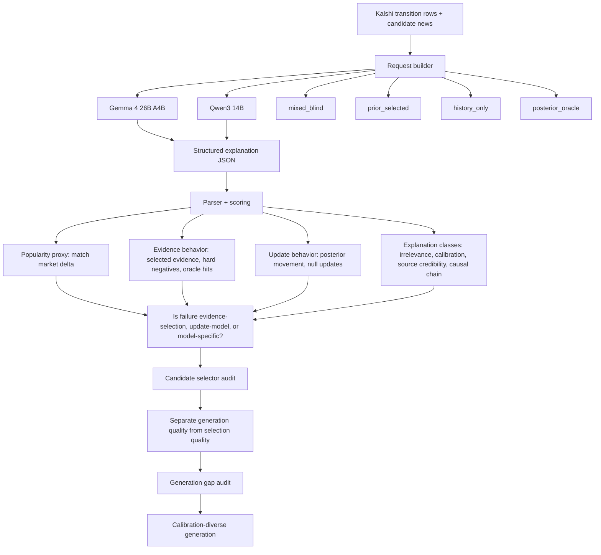

# Explanation Pilot Experiment Map

This diagram records the current experiment structure for the
market-for-explanations pilot.

## Current Runs

| Model | Run | Evidence regimes | Status |
| --- | --- | --- | --- |
| Gemma 4 26B A4B | Initial smoke | `mixed_blind`, `prior_selected` | complete |
| Gemma 4 26B A4B | Strict smoke | `mixed_blind`, `prior_selected` | complete |
| Gemma 4 26B A4B | Balanced Stage 1 | `mixed_blind`, `prior_selected` | complete |
| Gemma 4 26B A4B | Balanced diagnostic | `history_only`, `posterior_oracle` | complete |
| Gemma 4 26B A4B | Full-news ensemble x5, verbose schema | `mixed_blind` with up to 100 visible news items | cancelled after schema truncation audit; job `16778683` |
| Gemma 4 26B A4B | Full-news compact ensemble x5 | `mixed_blind` with up to 100 visible news items | cancelled after one row violated bounded arrays; job `16778846` |
| Gemma 4 26B A4B | Full-news bounded ensemble x5 | `mixed_blind` with up to 100 visible news items | complete; job `16779182`; parsed 86/100 responses |
| Gemma 4 26B A4B | Grounded non-null full-news bounded ensemble x5 | `mixed_blind` with up to 100 visible news items; `posterior_attributed_move` only | complete; job `16780895`; parsed 46/50 responses |
| Gemma 4 26B A4B | Grounded non-null test remainder x5 | same as above | complete; job `16781601`; parsed 22/22 responses |
| Gemma 4 26B A4B | Grounded non-null combined test x5 | same as above; 72 total requests | complete; parsed 68/72 responses; best-candidate positive-improvement rate 0.691 |
| Gemma 4 26B A4B | Grounded non-null train batch 001 x5 | same as above, train split, `kalshi_train` row IDs | complete; job `16782046`; parsed 95/100 responses |
| Gemma 4 26B A4B | Grounded non-null train batch 002 x5 | same as above, train split, `kalshi_train` row IDs | complete; job `16783833`; parsed 98/100 responses |
| Gemma 4 26B A4B | Grounded non-null train batch 003 x5 | same as above, train split, `kalshi_train` row IDs | complete; job `16783834`; parsed 97/100 responses |
| Gemma 4 26B A4B | Grounded non-null train batch 004 x5 | same as above, train split, `kalshi_train` row IDs | complete; job `16783883`; parsed 36/40 responses |
| Gemma 4 26B A4B | Selector baseline audit | train-all-batches selector training plus held-out test72 evaluation | complete; see `reports/explanation_pilot/gemma4_26b_selector_audit_summary_20260629.md` |
| Gemma 4 26B A4B | Generation gap audit | oracle-best candidate-pool evaluation before selector quality | complete; see `reports/explanation_pilot/gemma4_26b_generation_gap_audit_summary_20260629.md` |
| Qwen3 14B | Balanced Stage 1 | `mixed_blind`, `prior_selected` | complete |
| Qwen3 14B | Balanced diagnostic | `history_only`, `posterior_oracle` | complete |

## Local Request Files

These request files were used for the grounded non-null Gemma runs:

- `data/derived/explanation_pilot/requests/gemma4_26b_grounded_nonnull_remaining22_fullnews_bounded_ensemble5_20260629_requests.jsonl`
- `data/derived/explanation_pilot/requests/gemma4_26b_grounded_nonnull_train_batch001_fullnews_bounded_ensemble5_20260629_requests.jsonl`
- `data/derived/explanation_pilot/requests/gemma4_26b_grounded_nonnull_train_batch002_fullnews_bounded_ensemble5_20260629_requests.jsonl`
- `data/derived/explanation_pilot/requests/gemma4_26b_grounded_nonnull_train_batch003_fullnews_bounded_ensemble5_20260629_requests.jsonl`
- `data/derived/explanation_pilot/requests/gemma4_26b_grounded_nonnull_train_batch004_fullnews_bounded_ensemble5_20260629_requests.jsonl`

## Current Selector Finding

The candidate pool is often useful, but Gemma's own recommendation is not a
reliable selector. A leakage-safe selector audit showed:

- Gemma recommended top-1 on held-out test72: 0.396.
- Max selected evidence count with safe tie-breaking: 0.435.
- Max absolute update: 0.613.
- Core relative logistic selector: 0.532 top-1 and the best non-oracle mean
  market-price error.

The earlier 0.710 result for max selected evidence count was a tie-breaking
artifact caused by using row order from a ranking CSV sorted by market-error
rank.

## Current Generation Finding

Even with a post-hoc oracle selector, the generated candidate pool is too
narrow in posterior space:

- Mean persistence error on held-out test72: 0.181.
- Mean oracle-best candidate error: 0.140.
- Best candidate within 5 percentage points: 0.210.
- Target bracketed by generated posterior range: 0.000.
- Main gap type: right direction but under-updated, 38/62 prompts.
- No right-direction candidate: 22/62 prompts.

When the best candidate has the correct direction, its median update is only
about 25% of the actual market move. The next generation run should explicitly
produce calibration-diverse update models before we invest in a more complex
selector.
